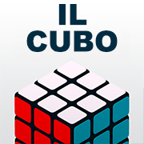

# 🧩 Il Cubo di Rubik — PWA

**© 2016–2025 pezzaliAPP — Tutti i diritti riservati**  
**Licenza d’Uso — Il Cubo di Rubik PWA**

---

## 📖 Panoramica

Questa **Progressive Web App (PWA)** dedicata al **Cubo di Rubik** è il risultato di un percorso personale e professionale iniziato nel **2017** e sviluppato nel corso di quasi dieci anni, con numerose iterazioni tecniche e grafiche.  

Il progetto nasce dopo un “inciampo” di **salute del 03 novembre 2016**: in quel momento un collega mi regalò un **Cubo di Rubik** come stimolo per reagire, mantenere la **dopamina** attiva e rimettere in moto la mente.  
Da lì è iniziato un viaggio fatto di prove, errori, studio e crescita nel coding.

> ℹ️ **Nota**: online possono esistere grafiche *simili* perché ispirate o rese possibili da **librerie pubbliche**.  
> Il codice applicativo di questa PWA resta **proprietario**: non è open source.

---

## 🎯 Obiettivi

- 🎮 Offrire un **gioco 3D** del Cubo, accessibile via browser (desktop e mobile).  
- 📲 Garantire **installazione e utilizzo offline** tramite PWA.  
- 🎨 Sviluppare un’interfaccia **usabile** e graficamente curata.  
- 📘 Documentare l’intero percorso tecnico come strumento di crescita personale.  

---

## 🛠️ Tecnologie principali
- 🟦 **three.js** → Rendering 3D del cubo e animazioni.  
- 📦 **PWA** → Manifest, icone, supporto installazione, caching offline.  
- 💻 **JavaScript + CSS** → UI minimale, controlli, timer e statistiche.  
- 🐍 **Python (storico)** → Algoritmo di risoluzione iniziale, poi “addomesticato” al gioco puro.

---

## ✨ Funzionalità
- 🔄 Rotazione 3D interattiva con animazioni fluide.  
- 📏 Dimensioni selezionabili (2×2, 3×3, 4×4, 5×5).  
- ⏱️ Timer e statistiche integrate (miglior tempo, media, record).  
- 🎨 Temi grafici multipli (Classico, Erno, Polvere, Camo, Pioggia).  
- 🌈 Regolazioni per tonalità, saturazione e luminosità.  
- 📥 Installazione come App Offline su desktop e mobile.  
- 📖 Pannello guida interattiva per principianti.

---

## 📖 Storia del progetto
- **2016** → Punto di partenza: un regalo (il Cubo di Rubik) come stimolo dopo un problema di salute.  
- **2017** → Primo algoritmo di risoluzione sviluppato in Python.  
- **2018–2020** → Esperimenti grafici con librerie open source.  
- **2021–2024** → Conversione verso il gioco, varianti di colore, dimensioni e stili.  
- **2025** → Versione PWA stabile, caching, interfaccia curata e guida integrata.

👉 Nota: online è possibile trovare grafiche simili, dovute all’uso di librerie 3D pubbliche.  
Il progetto, però, è stato adattato e personalizzato negli anni, diventando un vero percorso di crescita nel coding.

---

## 🚀 Aggiornamenti futuri
- 📱 Miglioramento interfaccia per dispositivi mobili.  
- 🏁 Modalità di gioco aggiuntive (es. sfide a tempo).  
- 🔊 Integrazione di suoni e feedback aptici.  
- 🧮 Supporto a varianti del cubo (es. Megaminx).

---

## ℹ️ Note personali

Io il Cubo non lo so risolvere.  
Ed è proprio per questo che ho iniziato a scrivere codice: prima un algoritmo in Python, poi una simulazione “addomesticata” al puro gioco.  

Molti suggerimenti e modifiche sono arrivati dagli appassionati online: colori, dimensioni e piccoli dettagli che hanno reso il progetto più vivo.

---

## 📌 Crediti & Licenza
- 👨‍💻 Autore: Alessandro Pezzali  
- 📅 Anni di sviluppo: 2016–2025  
- ⚖️ Licenza: **Uso personale — Tutti i diritti riservati**

© 2016–2025 pezzaliAPP. Tutti i diritti riservati.  
Il software, i contenuti e gli asset grafici sono concessi **esclusivamente in uso personale agli utenti finali**, senza trasferimento di diritti.

### ❌ Non è consentito, senza autorizzazione scritta:
- Copiare, modificare, distribuire o pubblicare il codice.  
- Utilizzare il progetto (o derivati) a fini commerciali.  
- Eseguire reverse engineering o rimuovere/alterare note di copyright.  

### ✅ È consentito:
- L’uso personale, non commerciale, per giocare e testare l’app.  

📬 Per richieste specifiche: 🌐 [pezzaliAPP.com](https://www.pezzaliapp.com)  
